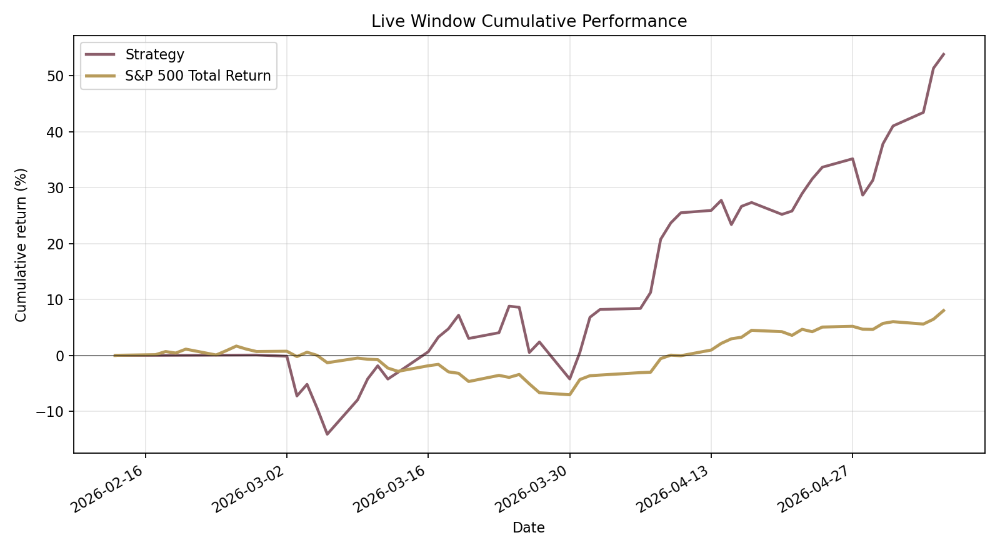
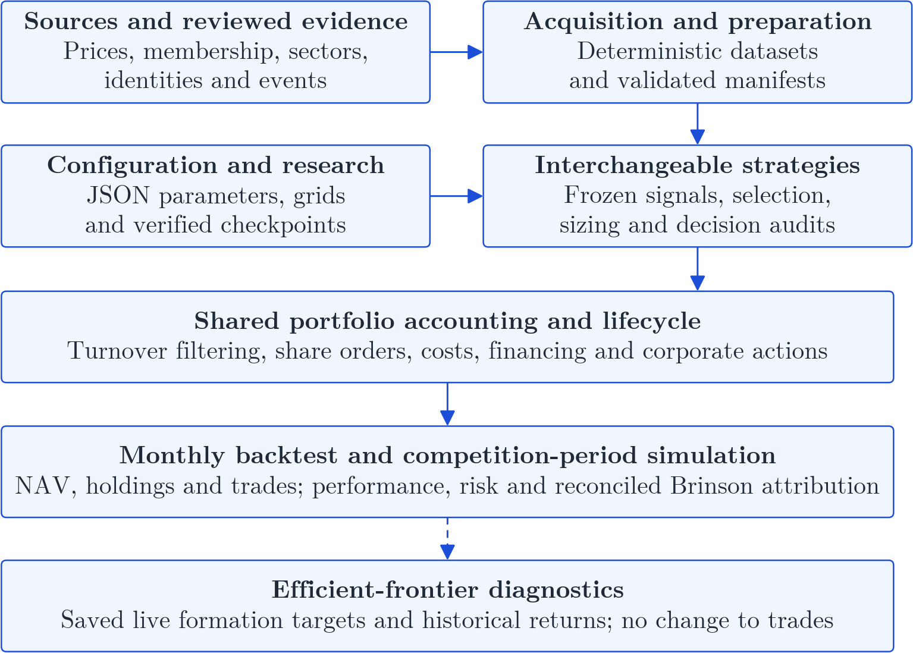
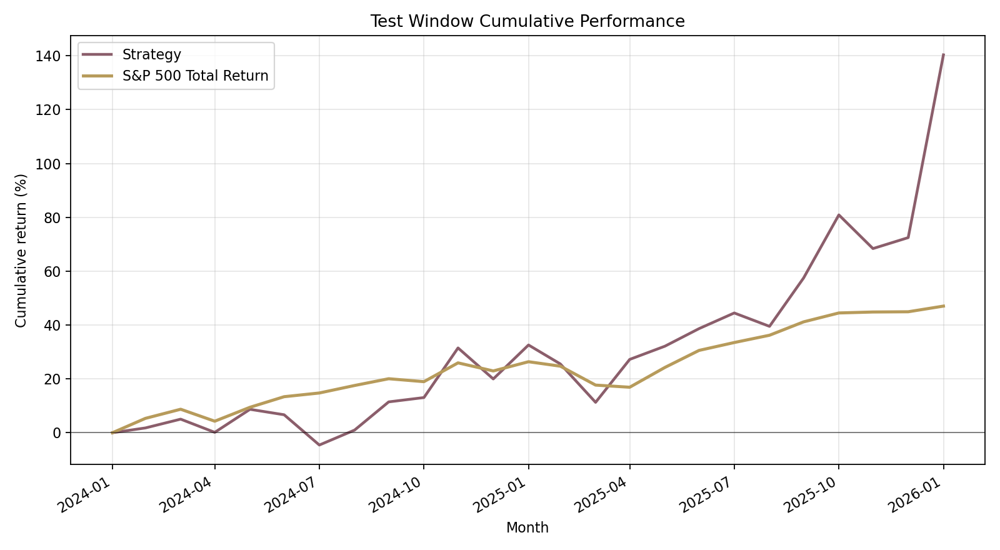
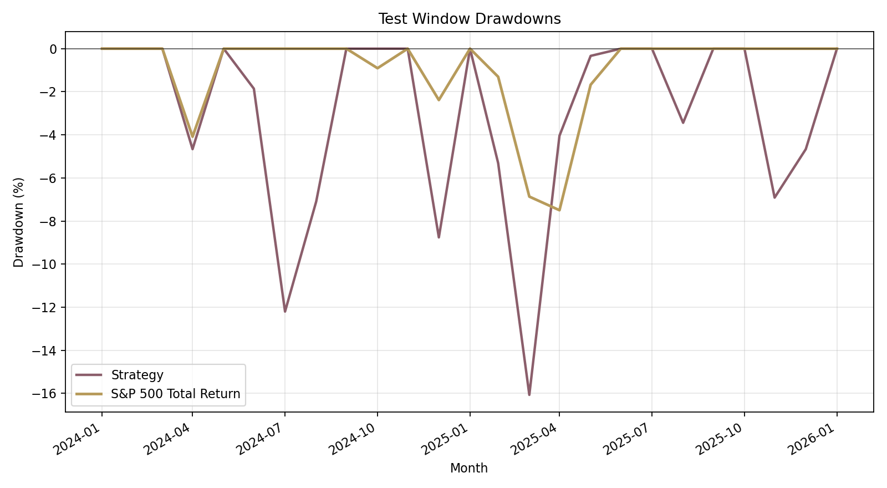
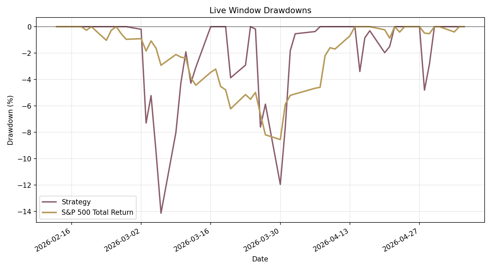
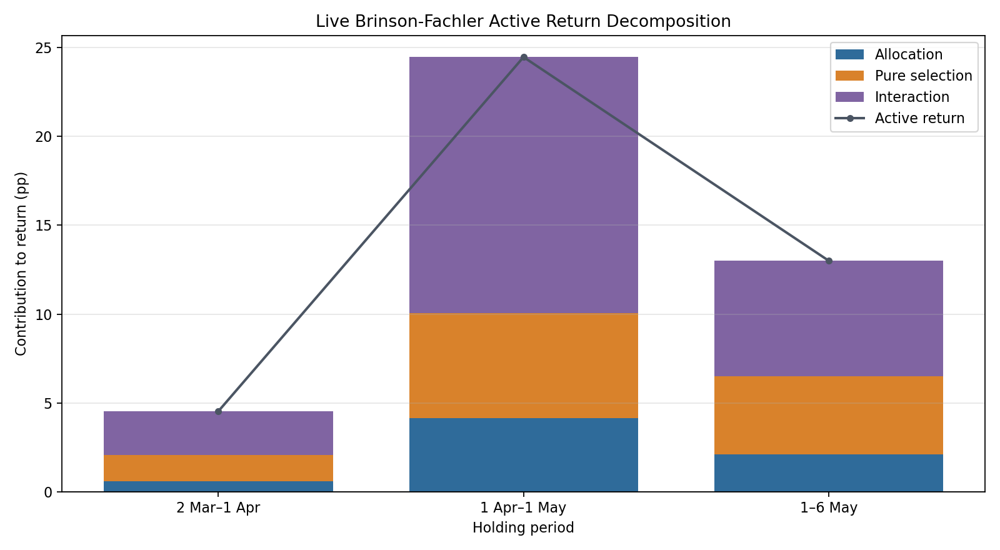
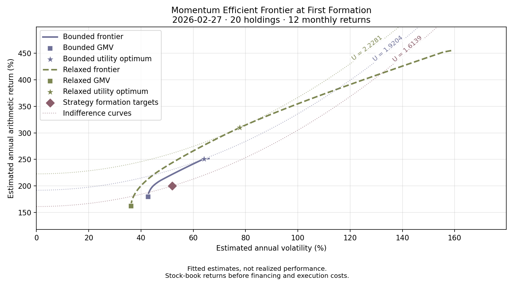

# Systematic Long-Short Equity Research

A Python research and portfolio analytics framework whose long-short momentum strategy **ranked 1st against the competition leaderboard**, delivering a simulated **45.82% net cumulative excess return** over the S&P 500 Total Return benchmark.

<p align="center">
  <a href="outputs/live/strategies/momentum/figures/live_window/cumulative_performance.png"></a>
</p>

## Project Overview

This project investigates whether systematic long-short stock selection can outperform the S&P 500 Total Return benchmark. It connects historical data preparation, strategy evaluation, portfolio accounting, and investment diagnostics in one reproducible framework.

Monthly market history spans January 2014-January 2026. The research design separates three roles:

- **2018-2023:** validation and candidate ranking.
- **February 2024-January 2026:** stability assessment and fresh-start portfolio evaluation, supporting final selection.
- **13 February-6 May 2026:** a separate live-window simulation evaluating the selected configuration.

The backtest uses Reuters-first monthly prices with reviewed Yahoo/WIKI fallbacks and omits ordinary dividends; its benchmark is total return. The competition simulation uses adjusted daily Yahoo prices; reviewed Reuters closes fill gaps in monthly signal history after dividend adjustment. Historical identities and membership are reconstructed; the [report](report/report.pdf) details eligibility, execution, and data conventions.

## System Architecture

<p align="center">
  <a href="report/figures/framework_architecture.png"></a>
</p>

Shared services make research choices inspectable and comparisons consistent:

- **Shared accounting.** One ledger handles signed positions, restricted short proceeds, whole-share orders, financing, and corporate actions across simulations: $2 per order plus modeled spreads, 2% cash interest, and 8% borrowing interest.
- **Auditable historical inputs.** Canonical identities, dated membership and sectors, reviewed provenance, and hashed manifests expose how observations become analytical inputs.
- **Interchangeable strategies.** A common [strategy contract](portfolio_core/strategies/strategy_contract.py) separates signals and portfolio construction from execution. Decisions retain signal cutoffs, target weights, and applied rules.
- **Reproducible searches.** Complete JSON configurations define investment rules. [Checkpoints](backtest/research_search.py) verify parameters, data, source fingerprints, runtime versions, and output hashes before resuming interrupted research.
- **Integrated analysis.** Saved decisions, trades, holdings, and NAV connect performance to reconciled attribution and frontier diagnostics. Tests cover accounting, identities, signal timing, checkpoints, and attribution.

## Repository Structure

<pre>
├── <a href="data_acquisition/">data_acquisition/</a>   Provider adapters and shared acquisition engine
├── <a href="portfolio_core/">portfolio_core/</a>     Strategies, identities, accounting, and analytics
├── <a href="backtest/">backtest/</a>           Monthly preparation, simulation, and parameter searches
├── <a href="live/">live/</a>               Competition-period preparation and daily valuation
├── <a href="efficient_frontier/">efficient_frontier/</a> Allocation diagnostics and sensitivity analysis
├── <a href="data/">data/</a>               Local inputs, prepared datasets, and provenance
├── <a href="outputs/">outputs/</a>            Saved research results, tables, and figures
├── <a href="tests/">tests/</a>              Accounting, data, strategy, and analytical checks
└── <a href="report/">report/</a>             Research report, figures, and retained selection evidence
</pre>

## Results Summary

### Momentum selection and historical performance

The selected configuration, **momentum #1292**, ranks six-month returns with a one-month skip. It targets ten longs and ten shorts, equally sized within each side, at **150% gross exposure: +105% long and −45% short**. A rank buffer retains incumbents through rank 15; a five-percentage-point resizing threshold limits small adjustments. Sector neutrality is disabled.

It ranked **fourth by validation return among 5,760 configurations**, then led the validation top-five shortlist over the later historical period. The [five-candidate selection evidence](report/evidence/momentum_selection/README.md) documents both comparisons.

Over February 2024-January 2026, momentum returned **140.37% net versus 47.04%** for the benchmark. Maximum month-end drawdowns were **16.07% versus 7.50%**.

<p align="center">
  <a href="outputs/backtest/strategies/momentum/figures/test_window/cumulative_performance.png"></a>
  <a href="outputs/backtest/strategies/momentum/figures/test_window/drawdown.png"></a>
</p>

Annualized volatility was **38.27%**, with Sharpe **1.28**, market beta **1.49**, Treynor **0.329**, and Information Ratio **0.881**. Annualized CAPM alpha was **22.17%** (p = **0.439**), not statistically significant at the 5% level. January 2026 supplied **48.37% of the period’s profit**, highlighting the concentration behind the cumulative result.

### Live performance and attribution

The [competition simulation](outputs/live/strategies/momentum/tables/strategy/performance.csv) returned **53.85% net versus 8.04%** over **13 February-6 May 2026**, after modeled trading costs and financing. Maximum daily drawdowns were **14.14% versus 8.56%**.

<p align="center">
  <a href="outputs/live/strategies/momentum/figures/live_window/cumulative_performance.png"></a>
  <a href="outputs/live/strategies/momentum/figures/live_window/drawdown.png"></a>
</p>

Annualized volatility was **52.28%**, with Sharpe **3.94**, market beta **1.99**, Treynor **1.04**, and Information Ratio **3.80**. Annualized CAPM alpha was **138.98%** (p = **0.139**), not statistically significant at the 5% level. The short sample and substantial market exposure limit conclusions about persistent risk-adjusted outperformance.

Brinson-Fachler attribution separates allocation, pure stock selection and interaction. Interaction was the largest contribution, led by the concentrated long Information Technology sleeve. The chart shows stock-sector effects across invested intervals, before account adjustments and compounding.

<p align="center">
  <a href="outputs/live/strategies/momentum/figures/brinson/active_decomposition_period.png"></a>
</p>

The [full account reconciliation](outputs/live/strategies/momentum/tables/brinson/account_reconciliation.csv) includes exposure, benchmark-reconstruction, financing, and execution-cost effects, reconciling to **45.82 percentage points of cumulative excess return**.

### Alternative strategy research

The comparison uses **2018-2023 net-return leaders from each alternative family**, alongside the selected momentum configuration.

| Strategy | Candidate | Return rank within family | Net return | Sharpe | Maximum drawdown |
|---|---:|---:|---:|---:|---:|
| **Selected momentum** | **#1292** | **4** | **73.79%** | **0.420** | **−26.36%** |
| Reversal | #1123 | 1 | 50.79% | 0.327 | −31.50% |
| Low volatility | #598 | 1 | 15.49% | 0.094 | −22.75% |
| Sector momentum | #881 | 1 | 69.34% | 0.556 | −16.42% |

Source: [retained aggregate searches](outputs/backtest/searches/). Reversal #1123 also leads its family by Sharpe. **Monthly trend is implemented; its grid search is unrun.**

### Efficient-frontier diagnostics

At first formation, **20 stocks share 12 monthly returns**, limited by Sandisk's (SNDK) February 2025 spin-off from Western Digital. Arithmetic means and Ledoit-Wolf covariance support bounded and relaxed allocations, with utility optima calibrated to questionnaire-based risk aversion. At the same estimated return, bounded reallocation reduces estimated volatility from **51.99% to 44.66%**.

<p align="center">
  <a href="outputs/efficient_frontier/momentum/figures/frontier.png"></a>
</p>

These fitted estimates precede financing and execution costs, with substantial uncertainty from the short sample. Optimized weights never enter the trading simulation.

## Reproducibility, CLI & Documentation

Saved results can be inspected without downloading market data. Reruns require `data/shared/supplied/reuters/SP500_Full_2014_2026_Cleaned.csv`, provider prices, benchmark series, shares data and reviewed historical reference records (membership, sectors, identities, corporate actions).

Raw third-party OHLCV (open, high, low, close, volume) downloads are not redistributed. The [acquisition CLI](data_acquisition/acquire.py) fetches Yahoo inputs through `yfinance`, subject to provider terms. It validates the local Reuters file but cannot download it.

With these inputs available, run the following from the repository root to create the Conda environment, prepare historical data and evaluate momentum:

```bash
conda env create -f environment.yml
conda run -n finance python -m backtest.prepare all
conda run -n finance python -m backtest.analyze all --strategy momentum
```

The CLI also covers acquisition, live simulations, attribution, parameter searches and frontier diagnostics. Prefix each module below with `conda run -n finance python -m`; append `--help` for options. `<…|…>` lists alternatives, `[…]` marks optional arguments, and `ID` is the strategy name, such as `momentum`.

| Command | Purpose |
|---|---|
| `data_acquisition.acquire <backtest\|live> <prices\|benchmark\|sectors\|shares\|all>` | Acquire or validate selected raw inputs. |
| `<backtest\|live>.prepare <core\|brinson\|all> [--check]` | Build core data, Brinson inputs, or both; `--check` validates without rewriting. |
| `<backtest\|live>.analyze <strategy\|brinson\|all> --strategy ID` | Run strategy/performance analysis, Brinson attribution, or both. |
| `backtest.search --strategy ID [--grid-file FILE] [--workers N]` | Run or resume validation grid searches. |
| `efficient_frontier.analyze --run-dir DIR` | Generate allocation diagnostics from the saved live run at `DIR`. |

Other research strategies require a complete JSON configuration through `--params-file FILE` for `strategy` or `all`. The `brinson` stage uses saved holdings. Acquisition offers `--dry-run`; search offers `--preflight-only` and `--output-dir DIR`.

## License

This project is licensed under the [MIT License](LICENSE).
